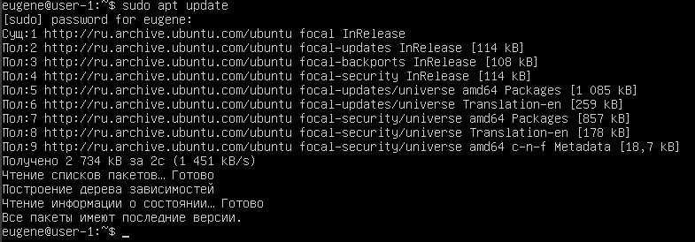
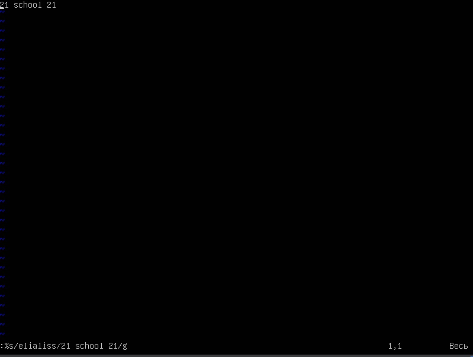
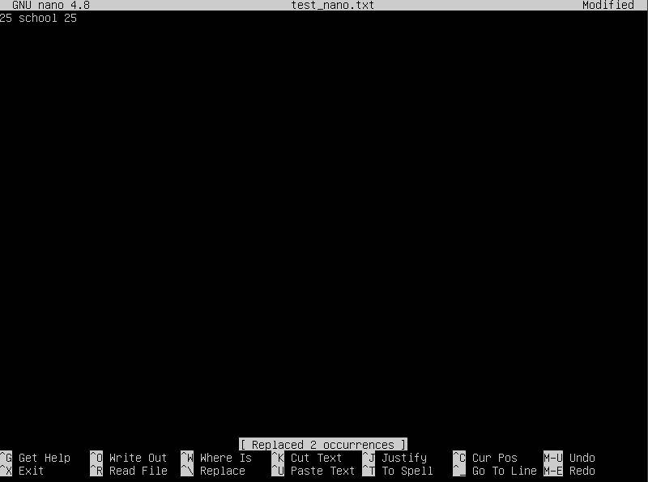
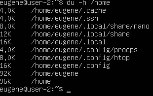
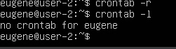

## Part 1. Установка ОС

+ Была установлена Ubuntu 20.04 Server LTS без графического интерфейса и выполнена команда:

`` cat /etc/issue. ``


## Part 2. Создание пользователя

+ Был создан новый пользователь `` myuser `` с помощью следующей команды:


+ После этого была выполнена команда:
 
``` cat /etc/passwd ```

+ В результате в конце вывода вышеприведенной команды была добавлена строка с новым пользователем. 


## Part 3. Настройка сети ОС

+ С помощью команды `` hostname `` изменим имя компьютера на `` user-1 ``.


+ Для смены часового пояса воспользуемся командой `` timedatectl set-timezone``.


+ loopback (коротко говоря lo) — это аппаратный или программный метод, который направляет полученный сигнал или данные обратно отправителю. Он используется как дополнительное средство в исправлении проблем физического соединения.

+ DHCP - это клиент-серверный протокол динамической конфигурации хоста (Dynamic Host Configuration Protocol), с помощью которого в ИТ-инфраструктуре сетевые параметры каждого нового устройства прописываются автоматически. Использование DHCP существенно упрощает работу системных администраторов в случаях расширения сети.


+ Для изменения статичных настроек необходимо отредактировать файл ``/etc/netplan/00-installer-config.yaml``.


+ Перезагрузим машину и посмотрим, изменилось ли содержимое вышеупомянутого файла.


+ Пропингуем `` 1.1.1.1 `` и ``ya.ru``.


## Part 4. Обновление ОС

+ Для обновления ОС воспользуемся командами ``apt update`` и ``apt upgrade``.



## Part 5. Использование команды sudo

+ Команда sudo ( substitute user and do, подменить пользователя и выполнить ) позволяет строго определенным пользователям выполнять указанные программы с административными привилегиями без ввода пароля суперпользователя root.


+ Перешли под пользователя ``myuser`` с помощью ``su myuser``.


## Part 6. Установка и настройка службы времени


## Part 7. Установка и использование текстовых редакторов

+ Использумые текстовые редакторы - vim, nano и joe

### Vim

+ Для создания файла используем команду ```vim test_vim.txt```


+ Для ввода нажимаем ```I``` и  после нажимаем ```Esc```, а после для выхода из vim с 
сохранением ввести команаду ```:wq```



+ После ввода необходимого текста необходимо нажать клавишу ```Esc```, а после для выхода из vim без
  сохранения ввести команаду ```:q!```

+ Для поиска элемента во всем файле необходимо ввести следующую команду ```:%s/<pattern>```, Vim будет
подсвечивать найденные части

+ Для замена элемента во всем файле необходимо ввести следующую команду ```:%s/<pattern>/<to>/g```

### Nano


+ После ввода необходимого текста необходимо нажать сочетание клавиш ```CTRL + X```, Nano спросит, необходимо ли 
сохранять изменения, нажимаем ```Y```, далее спросит имя файла для записи, указываем необходимое и нажимаем ```Enter```


+ После ввода необходимого текста необходимо нажать сочетание клавиш ```CTRL + X```, Nano спросит, необходимо ли
  сохранять изменения, нажимаем ```N```


+ Для поиска элемента необходимо нажать сочетание клавиш ```CTRL + W```, Nano предложит ввести то, что нужно найти, и
при удачном поиске перебросит курсор на начало найденного элемента



+ Для замена элемента необходимо нажать сочетание клавиш ```CTRL + \ ```, Nano предложит сначала ввести то, что необходимо
найти, а после то, на что необходимо заменить, выделит найденные участки и уточнит, необходимо ли заменить их

### Joe


+ После ввода необходимого текста необходимо нажать сочетание клавиш ```CTRL + K + D``` для выхода с создание файла, Joe
предложит ввести имя файла. После этого нажимаем ```CTRL + K + Q``` для выхода


+ После ввода необходимого текста необходимо нажать сочетание клавиш ```CTRL + K + Q``` для выхода без сохранения


+ Для поиска элемента необходимо нажать сочетание клавиш ```CTRL + K + F```, Joe предложит ввести то, что нужно найти, 
далее предложит выбрать одну из доступных опций:
  + I - не различать при поиске символы верхнего и нижнего регистров. Обычно считается, что они различны.
при удачном поиске перебросит курсор на начало найденного элемента;
  + B - поиск назад, а не вперед;
  + число - если ввести число - Joe найдет n-ное вхождение искомого текста;
  + R - замещать текст, далее будет предложено ввести текст для замены.
Просто нажимаем ```Enter```, в случае успешного поиска Joe переставит курсор на конец последнего найденного фрагмента


+ Для замены элемента нажимаем ```CTRL + K + F```, вводим искомый текст и выбираем опцию R для замены, после вводим новый
текст, Joe спросит заменить ли выделенный текст, нажимаем ```Y```, после этого переключится на другой выделенный фрагмент
и будет делать эти операции до тех пор, пока не закончатся все нахождения

## Part 8. Установка и базовая настройка сервиса SSHD

+ Для установки воспользуемся командой ```sudo-apt install openssh-server```
+ Для автозапуска введем команду ```sudo systemctl enable ssh.service```
+ Для перенастройки службы необходимо отредактировать конфиг ```/etc/ssh/sshd_config```

+ Перед выполнением следующего пункта задания перезагружаем службу командой ```sudo systemctl restart sshd.service```

Утилита `ps` одна из самых простых и в то же время часто используемых программ для просмотра списка процессов в Linux.
- a - выбрать все процессы, кроме фоновых
- u - выбрать процессы пользователя
- x - При отображении процессов, соответствующих другим параметрам, включите процессы, у которых нет управляющего терминала. Это противоположность опции -X. Если в одной команде указаны и -X, и -x, то ps будет использовать тот, который был указан последним.

+ Далее выполняем команду ```ps aux``` и для того, чтобы отобразить только искомыый процесс дополняем команду поиском
  по шаблону: ```ps aux | grep sshd```


+ Для перезагрузки используем команду ```reboot```
+ Используем команду ```netstat -tan```


Программа `netstat` показывает статус сети. Флаги:
+ `-t` отображает список соединения TCP,
+ `-a` показывает список всех портов,
+ `-n` отображает в числовом формате, не отображая имя хоста.

Расшифровка столбцов:
- 1 - протокол подключения, 
- 2 - полученные пакеты, 
- 3 - отправленные пакеты,
- 4 - локальный адрес, 
- 5 - удаленный адресс, 
- 6 - статус.

Адресс `0.0.0.0` используется в сети как немаршрутизируемый адрес IPv4, 
он используется во время инициализации системы, когда устройство использует его до того, как ему 
будет назначен реальный IP-адрес, в качестве адреса по умолчанию.

## Part 9. Установка и использование утилит top, htop

+ Для установки утилиты htop используем ```sudo apt install htop```, утилита top в системе уже предустановлена

### Top


+ uptime - 4 минуты
+ количество авторизованных пользователей - 1
+ общую загрузку системы - 0,7 0,29 0,16 
+ общее количество процессов - 99
+ загрузку cpu


+ загрузку памяти


+ pid процесса занимающего больше всего памяти


+ pid процесса, занимающего больше всего процессорного времени


### Htop

+ Отсортированный по:
  + PID,

  
  + PERCENT_CPU,

  
  + PERCENT_MEM,

  
  + TIME

  

+ Отфильтрованный для процесса sshd:


+ С процессом syslog, найденным, используя поиск:


+ С добавленным выводом hostname, clock и uptime


## Part 10. Использование утилиты fdisk

+ Запускаем команду ```sudo fdisk -l```


+ Название жесткого диска - ```/dev/sda```
+ Размер - ```3.29 GiB, 3523911680 bytes```
+ Количество секторов - ```6882640 sectors```
+ Размер swap - ```0```, отсутствует

## Part 11. Использование утилиты df


+ Для корневого раздела (/):
  + размер раздела - ```3306244```
  + размер занятого пространства - ```2834992```
  + размер свободного пространства - ```282992```
  + процент использования - ```91%```

Единица измерения - Кбайт


+ Для корневого раздела (/):
  + размер раздела - ```3.2G```
  + размер занятого пространства - ```2.8``` 
  + размер свободного пространства - ```277M```
  + процент использования - ```91%```

Тип файловой системы - ```ext4```

## Part 12. Использование утилиты du

### /home




### /var


### /var/log


## Part 13. Установка и использование утилиты ncdu

+ Для установки используем команду ```sudo apt install ncdu```
+ Запускаем команду ```ncdu /```


## Part 14. Работа с системными журналами

+ Для открытия логов используем VIM


+ Последняя авторизация:


+ Для перезапуска службы используем ```sudo systemctl restart sshd.service```
+ Рестарт службы в логах:


## Part 15. Использование планировщика заданий CRON

+ Запсукаем CRON с помощью ```crontab -e```


+ Редактируем с помощью nano, поэтому выбираем 5 и добавляем в конец следующую строку:


+ Проверим результат в логах:


+ Список текущих задач получим с помощью команды ```crontab -l```

+ Для удаления задач воспользуемся командой ```crontab -r```, а после проверим её выполнение

